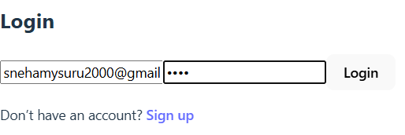
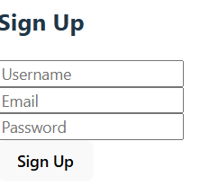
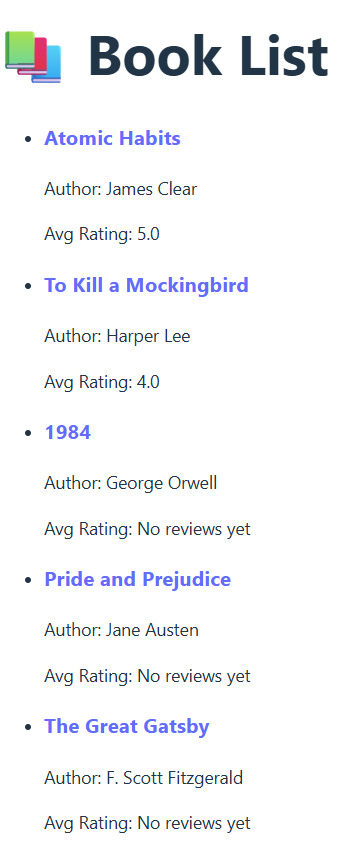
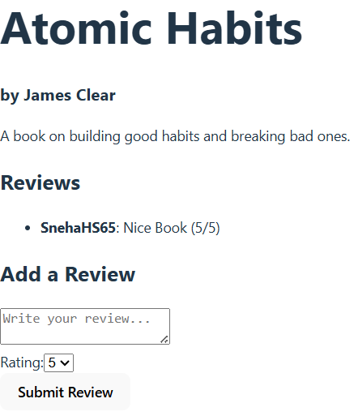
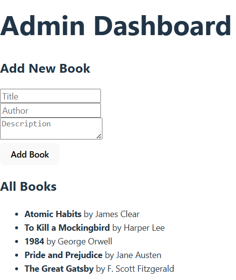

# 📚 Book Review Platform

The **Book Review Platform** is a full-stack web application where users can sign up, browse books, and write reviews, while admins can manage the book catalog. It's built using **React (frontend)** and **GraphQL + Node.js (backend)**, with a focus on clean UI, role-based access, and real-time updates.

- 🔒 Users can log in, read reviews, and submit their own.
- 🛠️ Admins can add new books and view the entire collection.

## ✨ Features

### 👤 User
- 🔐 **Login/Sign Up** using email and password
- 📚 **View all books** after login
- 📝 **Write a review** and read others' reviews

### 👩‍💼 Admin
- ➕ **Add new books** to the catalog
- 📖 **View all available books**

> ✅ Role-based access ensures only admins can add books.
## 🖼️ Screenshots

### 🔐 Login Page

> Users can log in securely using their credentials.

### 🆕 Sign Up Page

> New users can create an account and start reviewing books.

### 📚 All Books Page

> Browse all available books and read community reviews.

### 📝 Review Form

> Users can submit their own review and rating for any book.

### 🛠️ Admin Dashboard

> Admins can add new books with title, author, and description.

## ⚙️ Tech Stack

### 🖥 Frontend
- React (with Vite)
- TypeScript
- Tailwind CSS
- Apollo Client
- React Router DOM

### 🔧 Backend
- Node.js
- GraphQL
- Prisma ORM
- PostgreSQL
- bcrypt for password hashing

### 🌐 Dev Tools
- VS Code
- Git & GitHub
- Prisma Studio

